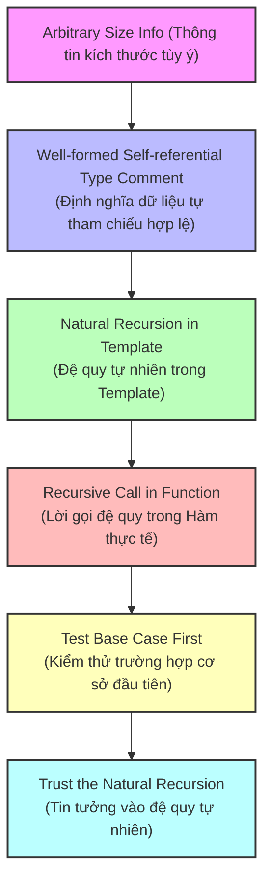

# Ghi chú: Self-Reference — Arbitrary Sized Data

> **Khóa học:** How to Code: Simple Data  
> **Giảng viên:** Gregor Kiczales  
> **Chủ đề:** 4a. Self-Reference

---

## 1. Ôn tập: Những gì đã học

| Tuần | Chủ đề | Ví dụ |
|------|--------|-------|
| 1 | Primitive Data & Operations | Number, String, Image, Boolean |
| 2 | How to Design Functions (HtDF) | Signature → Purpose → Stub → Examples → Template → Code |
| 2 | How to Design Data (HtDD) | Atomic, Enumeration, Itemization |
| 3 | How to Design Worlds (HtDW) | `big-bang`, `on-tick`, `to-draw`, `on-key` |
| 3 | Compound Data | `define-struct`, Cowabunga 🐄 |

> Tất cả data definitions từ trước đến giờ đều là **fixed-size** — biết trước có bao nhiêu trường dữ liệu.

---

## 2. Vấn đề mới: Arbitrary Sized Data

### Fixed-size vs Arbitrary-size

| | Fixed-size | Arbitrary-size |
|--|-----------|----------------|
| **Đặc điểm** | Biết trước số lượng trường | **Không biết** trước có bao nhiêu phần tử |
| **Ví dụ** | `(make-cow 10 3)` — luôn có 2 trường | Danh sách đội hockey yêu thích — có thể 0, 1, 5, 100... |
| **Dùng khi** | Thông tin có cấu trúc cố định | Thông tin có **số lượng thay đổi** |

### Ví dụ thực tế

- Tất cả đội hockey yêu thích của ai đó → **không biết trước** có bao nhiêu đội
- Tất cả sinh viên trong một khóa học → **không biết trước** có bao nhiêu sinh viên
- Danh sách bài tập cần làm → **thay đổi** theo thời gian

> 🔑 **Câu hỏi trọng tâm:** Làm sao biểu diễn dữ liệu mà ta **không biết trước kích thước**?

---

## 3. Tuần này sẽ học gì?

1. **Data definitions** cho arbitrary sized data → sử dụng **self-reference** (đệ quy trong data definition)
2. **Functions** trên arbitrary sized data → hàm cũng sẽ có cấu trúc **đệ quy** theo template

> 💡 **Dự đoán:** Template của hàm sẽ phản ánh cấu trúc của data definition — nếu data đệ quy thì hàm cũng đệ quy!

---

## 4. BSL List Primitives — Cơ chế cơ bản

> Tương tự tuần trước: học `define-struct` trước → rồi mới thiết kế compound data.  
> Tuần này: học **list primitives** trước → rồi mới thiết kế với list.

### 4.1. `empty` — Danh sách rỗng

```racket
empty    ;; → empty
```

- `empty` là một **giá trị** (value), không phải hàm
- Nó là danh sách rỗng của **bất kỳ thứ gì** — rỗng strings, rỗng numbers, rỗng hockey teams...
- Vì nó rỗng nên kiểu phần tử không quan trọng

### 4.2. `cons` — Xây dựng danh sách

`cons` thêm một phần tử vào **đầu** một danh sách:

```racket
;; Danh sách 1 phần tử
(cons "flames" empty)
;; → (cons "flames" empty)

;; Danh sách 2 phần tử
(cons "leafs" (cons "flames" empty))
;; → (cons "leafs" (cons "flames" empty))
```

> 💡 Đọc từ ngoài vào: "`cons` tạo danh sách mà `"leafs"` ở đầu, phần còn lại là `(cons "flames" empty)`"

#### Operands có thể là biểu thức

```racket
(cons (string-append "C" "anucks") empty)
;; → (cons "Canucks" empty)
```

Racket **tính toán** biểu thức trước, rồi mới đưa **giá trị** vào danh sách.

#### List có thể chứa bất kỳ kiểu nào

```racket
;; List of Numbers (điểm quiz)
(define L1 (cons 10 (cons 9 (cons 10 empty))))

;; List of Images
(define L2 (cons (square 10 "solid" "blue")
                 (cons (triangle 20 "solid" "green")
                       empty)))
```

> ⚠️ Về mặt cơ chế, BSL **cho phép** trộn kiểu trong 1 list (ví dụ string và number). Nhưng **data definitions của chúng ta sẽ không cho phép** — mỗi list chỉ chứa 1 kiểu dữ liệu.

### 4.3. `first` — Lấy phần tử đầu tiên

```racket
(define L1 (cons "flames" empty))
(define L2 (cons 10 (cons 9 (cons 10 empty))))

(first L1)   ;; → "flames"
(first L2)   ;; → 10
```

### 4.4. `rest` — Lấy phần còn lại (bỏ phần tử đầu)

```racket
(rest L1)    ;; → empty
(rest L2)    ;; → (cons 9 (cons 10 empty))
```

### 4.5. Truy cập phần tử thứ n — Chỉ dùng `first` và `rest`

```racket
;; Phần tử thứ 2:
(first (rest L2))              ;; → 9
;;     ^^^^^^^^ bỏ phần tử đầu
;; ^^^^^ lấy phần tử đầu của phần còn lại

;; Phần tử thứ 3:
(first (rest (rest L2)))       ;; → 10
```

> ⚠️ Gregor yêu cầu: **Chỉ dùng `first` và `rest`**, KHÔNG dùng `second`, `third` (dù BSL có sẵn). Lý do: vài bài giảng nữa sẽ thấy cách xử lý tốt hơn bằng đệ quy.

### 4.6. `empty?` — Kiểm tra danh sách rỗng

```racket
(empty? empty)                          ;; → true
(empty? (cons "flames" empty))          ;; → false
(empty? 1)                              ;; → false
```

- Tên kết thúc bằng `?` → đây là **predicate** (trả về Boolean)
- Câu hỏi thường gặp nhất: *"Danh sách tôi đang giữ có rỗng không?"*

---

## 5. Tóm tắt: List Primitives

### So sánh với Compound Data (`define-struct`)

| | Compound Data (struct) | List |
|--|----------------------|------|
| **Tạo** | `(make-cow x dx)` | `(cons val list)` |
| **Lấy trường 1** | `(cow-x c)` | `(first lst)` |
| **Lấy trường 2** | `(cow-dx c)` | `(rest lst)` |
| **Kiểm tra** | `(cow? c)` | `(empty? lst)` |
| **Kích thước** | Cố định (2 trường) | **Tùy ý** (0, 1, 2, ..., n phần tử) |

> 🔑 **Insight:** `cons` giống constructor, `first`/`rest` giống selectors, `empty?` giống predicate — danh sách thực chất là **compound data đệ quy**!

### Bảng tham chiếu nhanh

| Primitive | Loại | Input → Output | Ý nghĩa |
|-----------|------|----------------|----------|
| `empty` | Value | — | Danh sách rỗng |
| `cons` | Constructor | `X List → List` | Thêm phần tử vào đầu list |
| `first` | Selector | `List → X` | Phần tử đầu tiên |
| `rest` | Selector | `List → List` | Mọi thứ trừ phần tử đầu |
| `empty?` | Predicate | `Any → Boolean` | Danh sách rỗng? |

---

---

## 6. Thiết kế Data Definition với Self-Reference (HtDD)

Để thiết kế dữ liệu có kích thước tùy ý (arbitrary-sized data), ta sử dụng kỹ thuật **Self-Reference (Tự tham chiếu)**. Bản thân kiểu dữ liệu sẽ được định nghĩa thông qua chính nó.

### 6.1. Định nghĩa kiểu dữ liệu `ListOfString`

Dưới đây là thiết kế chuẩn theo quy trình HtDD cho danh sách chứa các chuỗi ký tự (ví dụ: tên các trường đại học):

```racket
;; =================
;; Data Definitions:

;; ListOfString is one of:
;;  - empty
;;  - (cons String ListOfString)
;; interp. a list of strings

(define LOS1 empty)
(define LOS2 (cons "UBC" empty))
(define LOS3 (cons "McGill" (cons "UBC" empty)))

#;
(define (fn-for-los los)
  (cond [(empty? los) (...)]                  ; Clause 1: Base case
        [else                                 ; Clause 2: Recursive case
         (... (first los)                     ; String
              (fn-for-los (rest los)))]))     ; Natural recursion to ListOfString

;; Template rules used:
;;  - one-of: 2 cases
;;  - atomic distinct: empty
;;  - compound: (cons String ListOfString)
;;  - self-reference: (rest los) is ListOfString
```

### 6.2. Các điểm mấu chốt trong thiết kế
- **Base Case (Trường hợp cơ sở):** `empty` là điểm dừng. Mọi định nghĩa dữ liệu tự tham chiếu **bắt buộc** phải có ít nhất một trường hợp không tự tham chiếu (base case) để tránh đệ quy vô hạn.
- **Self-Reference (Tự tham chiếu):** Thành phần `(cons String ListOfString)` chứa `ListOfString` ở cuối. Điều này phản ánh cấu trúc dữ liệu có thể dài vô hạn: một chuỗi đứng đầu, theo sau là *một danh sách các chuỗi khác*.
- **Natural Recursion (Đệ quy tự nhiên) trong Template:** Trong template của hàm, đối với phần dữ liệu tự tham chiếu `(rest los)` (kiểu `ListOfString`), ta thực hiện một lời gọi hàm đệ quy tự nhiên `(fn-for-los (rest los))`.

---

## 7. Thiết kế Function với Self-Reference (HtDF)

Khi cấu trúc dữ liệu là tự tham chiếu (self-referential), cấu trúc hàm xử lý dữ liệu đó cũng sẽ đệ quy (recursive). Lời gọi hàm đệ quy tự nhiên trong template sẽ giúp duyệt qua từng phần tử của danh sách cho đến khi gặp trường hợp cơ sở (`empty`).

### 7.1. Ví dụ: Thiết kế hàm `contains-ubc?`

**Bối cảnh:** Chúng ta dùng kiểu dữ liệu `ListOfString` đại diện cho danh sách các đội Quidditch yêu thích (favorite Quidditch teams).

**Yêu cầu:** Thiết kế hàm kiểm tra xem danh sách các chuỗi có chứa chuỗi `"UBC"` hay không.

#### Bước 1: Signature, Purpose, và Stub
```racket
;; ListOfString -> Boolean
;; Trả về true nếu danh sách có chứa chuỗi "UBC"
(stub (define (contains-ubc? los) false))
```

#### Bước 2: Examples / Tests
Ta viết các test bao quát tất cả các trường hợp của data definition (danh sách rỗng, danh sách không chứa, danh sách chứa ở đầu, chứa ở sau):
```racket
(check-expect (contains-ubc? empty) false)
(check-expect (contains-ubc? (cons "McGill" empty)) false)
(check-expect (contains-ubc? (cons "UBC" empty)) true)
(check-expect (contains-ubc? (cons "McGill" (cons "UBC" empty))) true)
```

#### Bước 3: Template & Code Implementation
Dựa vào template của `ListOfString`, ta điền logic vào các dấu ba chấm `(...)`:
- Với nhánh `(empty? los)`: Theo ví dụ đầu tiên, kết quả là `false`.
- Với nhánh `else` (trường hợp danh sách không rỗng): Ta có `(first los)` là một chuỗi (ví dụ: `"McGill"` hoặc `"UBC"`).
  - Ta kiểm tra xem `(first los)` có bằng `"UBC"` không: `(string=? (first los) "UBC")`.
  - Nếu đúng, ta trả về `true`.
  - Nếu sai (ví dụ khi gặp `"McGill"`), ta cần tìm tiếp trong phần còn lại của danh sách `(rest los)`.

> 💡 **Phân tích "Sự phỏng đoán may mắn" (Lucky Guess) của Gregor Kiczales:**
>
> Ở nhánh sai của câu lệnh kiểm tra, Gregor cần một hàm có khả năng: *nhận vào phần còn lại của danh sách `(rest los)` (kiểu `ListOfString`) và trả về xem nó có chứa `"UBC"` hay không.*
>
> Gregor tự hỏi: *"Có hàm nào nhận vào một ListOfString và trả về Boolean cho biết nó có chứa 'UBC' không?"*
>
> Câu trả lời là: **Chính là hàm `contains-ubc?` mà chúng ta đang viết!**
>
> Do đó, Gregor thực hiện một cú phán đoán táo bạo (lucky guess) bằng cách gọi chính `contains-ubc?` cho phần rest: `(contains-ubc? (rest los))`. Khi chạy thử, tất cả các bài test đều vượt qua một cách kỳ diệu! Đây chính là **Recursion (Đệ quy)**.

```racket
(define (contains-ubc? los)
  (cond [(empty? los) false]
        [else
         (if (string=? (first los) "UBC")
             true
             (contains-ubc? (rest los)))]))
```

### 7.2. Giải thích cơ chế chạy (Trace Evaluation)
Hãy xem cách Racket thực thi hàm đệ quy `contains-ubc?` từng bước:

```racket
(contains-ubc? (cons "McGill" (cons "UBC" empty)))
```

1. Đầu tiên, `(empty? los)` là `false`, chương trình đi vào nhánh `else`.
2. Biểu thức điều kiện kiểm tra: `(string=? "McGill" "UBC")` → `false`.
3. Hàm đi vào nhánh sau của `if` và kích hoạt cuộc gọi đệ quy:
   ```racket
   (contains-ubc? (cons "UBC" empty))
   ```
4. Ở lượt gọi đệ quy này, `(empty? los)` tiếp tục là `false`, đi vào nhánh `else`.
5. Biểu thức điều kiện kiểm tra: `(string=? "UBC" "UBC")` → `true`.
6. Nhánh `if` trả về `true` ngay lập tức.
7. Toàn bộ chuỗi tính toán hoàn tất và trả về kết quả cuối cùng: `true`.

---

## 8. Giải thích các "Phỏng đoán may mắn" & Quy tắc chuẩn hóa (HtDD & HtDF)

Trong bài giảng thứ ba, Giáo sư Gregor Kiczales đã chính thức hóa các "phỏng đoán may mắn" ở các bài học trước thành những quy tắc hệ thống hóa nền tảng trong Khoa học máy tính.

### 8.1. Thế nào là một Định nghĩa dữ liệu tự tham chiếu hợp lệ (Well-formed)?

Khi thông tin cần biểu diễn có **kích thước tùy ý (arbitrary-sized)** (không biết trước số lượng phần tử là 0, 1, 30 hay 60), ta sử dụng **Định nghĩa dữ liệu tự tham chiếu (Self-referential data definition)**.

Để định nghĩa này không bị "bùng nổ" (infinite loop), nó phải **hợp lệ (well-formed)** bằng cách thỏa mãn điều kiện:
1. **Có ít nhất một trường hợp cơ sở (base case):** Trường hợp không chứa tự tham chiếu (ví dụ: `empty`). Đây là điều kiện dừng.
2. **Có ít nhất một trường hợp tự tham chiếu (self-referential case):** Trường hợp định nghĩa chứa chính nó (ví dụ: `(cons String ListOfString)`). Đây là phần cho phép dữ liệu kéo dài tùy ý.

### 8.2. Quy tắc Template: Self-Reference Rule & Natural Recursion

Khi viết template cho một kiểu dữ liệu tự tham chiếu:
- Khi gặp selector lấy ra trường tự tham chiếu (ví dụ: `(rest los)` có kiểu `ListOfString`), ta áp dụng **Self-reference rule**: Bọc selector đó trong một lời gọi tới chính hàm template: `(fn-for-los (rest los))`.
- Lời gọi này được gọi là **Đệ quy tự nhiên (Natural Recursion)**. Nó xuất hiện khớp chính xác với vị trí tự tham chiếu trong Type Comment.

> ⚠️ **Lưu ý cực kỳ quan trọng khi code:**  
> Khi copy template để viết hàm thực tế, bạn **phải đổi tên** ở cả hai nơi: định nghĩa hàm `(define (contains-ubc? los) ...)` và **tất cả các cuộc gọi đệ quy tự nhiên** bên trong thân hàm. Nếu quên đổi tên cuộc gọi đệ quy, chương trình sẽ báo lỗi hoặc chạy sai.

---

## 9. Chỉ dẫn thiết kế và Kiểm thử với List (HtDF Guidelines)

Gregor đưa ra các chỉ dẫn quan trọng giúp thiết kế và kiểm thử hàm xử lý danh sách một cách hiệu quả và chính xác:

### 9.1. Đưa Test của trường hợp cơ sở (Base Case) lên đầu tiên
Trong phần `check-expect`, luôn đặt test của `empty` (hoặc base case) lên đầu. Lý do:
1. **Đơn giản trước:** Giúp ta tư duy và làm rõ trường hợp cơ sở, đơn giản nhất trước.
2. **Ảnh hưởng dây chuyền:** Mọi lời gọi đệ quy cuối cùng đều duyệt về trường hợp cơ sở. Nếu trường hợp cơ sở có bug, toàn bộ các test đệ quy phức tạp phía sau cũng sẽ thất bại. Việc sửa bug ở base case trước giúp quá trình debug dễ dàng hơn rất nhiều.

### 9.2. Viết test với danh sách có ít nhất 2 phần tử
Luôn có ít nhất một test kiểm tra danh sách có độ dài $\ge 2$ (ví dụ: `(cons "McGill" (cons "UBC" empty))`). Điều này giúp phát hiện ra các lỗi logic mà danh sách 0 hoặc 1 phần tử không thể làm lộ ra.

### 9.3. Tin tưởng vào Đệ quy tự nhiên (Trust the Natural Recursion)
- Khi viết logic cho nhánh đệ quy, hãy **tin tưởng tuyệt đối** rằng lời gọi `(contains-ubc? (rest los))` sẽ hoạt động và trả về kết quả đúng cho phần còn lại của danh sách.
- **Tránh việc can thiệp sâu** hoặc cố gắng viết thêm logic phức tạp lồng vào bên trong đối số của lời gọi đệ quy. Việc tin tưởng đệ quy tự nhiên giúp giữ code sạch sẽ và tránh các lỗi logic rối rắm.

---

## 10. Chuỗi tương quan hệ thống (The Systematic Chain)

Gregor đúc kết lại toàn bộ quy trình thiết kế có hệ thống từ dữ liệu đến kiểm thử:



> 🔑 **Đúc kết cốt lõi:**  
> **Cấu trúc của dữ liệu quyết định cấu trúc của hàm (The shape of the data determines the shape of the function).**  
> Nhờ quy tắc đối chiếu này, việc viết code đệ quy không còn là sự mò mẫm hay may rủi, mà trở thành một quy trình dịch thuật cơ học trực tiếp từ cấu trúc dữ liệu sang cấu trúc hàm!

---

## 11. Bài tập thực hành: Owlery (Thiết kế hoàn chỉnh với List)

Bài giảng thứ tư minh họa toàn bộ quy trình thiết kế từ đầu đến cuối qua bài toán ba phần: thiết kế data definition cho trọng lượng các con cú trong owlery (chuồng cú), rồi thiết kế hai hàm xử lý dữ liệu đó.

### 11.1. Data Definition: `ListOfNumber`

Vì ta không biết trước có bao nhiêu con cú trong owlery, ta cần **arbitrary-sized data** → dùng **well-formed self-referential data definition**:

```racket
;; =================
;; Data Definitions:

;; ListOfNumber is one of:
;;  - empty
;;  - (cons Number ListOfNumber)
;; interp. each number in the list is an owl weight in ounces

(define LON1 empty)
(define LON2 (cons 60 (cons 42 empty)))

#;
(define (fn-for-lon lon)
  (cond [(empty? lon) (...)]
        [else
         (... (first lon)                    ; Number
              (fn-for-lon (rest lon)))]))    ; Natural recursion

;; Template rules used:
;;  - one-of: 2 cases
;;  - atomic distinct: empty
;;  - compound: (cons Number ListOfNumber)
;;  - self-reference: (rest lon) is ListOfNumber
```

> 💡 **Lưu ý:** Luôn đặt ví dụ base case (`empty`) lên đầu trong phần data examples.

---

### 11.2. Hàm 1: `sum` — Tính tổng trọng lượng

**Yêu cầu:** Thiết kế hàm nhận danh sách trọng lượng các con cú, trả về tổng trọng lượng.

#### Signature, Purpose, Stub
```racket
;; ListOfNumber -> Number
;; produce total weight of owls in consumed list
(define (sum lon) 0)   ; stub
```

#### Examples / Tests
```racket
(check-expect (sum empty) 0)
(check-expect (sum (cons 60 empty)) (+ 60 0))          ; = 60
(check-expect (sum (cons 60 (cons 42 empty))) (+ 60 42)) ; = 102
```

> 💡 **Mẹo viết test:** Gregor viết kết quả dưới dạng `(+ 60 0)` thay vì chỉ viết `60`. Cách viết này giúp ta *tư duy về cách hàm sẽ hoạt động*: kết quả = trọng lượng đầu tiên + tổng phần còn lại. Đây là bước chuẩn bị tư duy cho việc code thân hàm.

#### Code Implementation
```racket
(define (sum lon)
  (cond [(empty? lon) 0]
        [else
         (+ (first lon)
            (sum (rest lon)))]))
```

**Phân tích cách code:**
- `(empty? lon)` → trả về `0` (tổng của danh sách rỗng là 0).
- `else` → cộng phần tử đầu `(first lon)` với **kết quả của đệ quy tự nhiên** `(sum (rest lon))`.
- Ta **tin tưởng** rằng `(sum (rest lon))` sẽ trả về đúng tổng trọng lượng của các con cú còn lại.

---

### 11.3. Hàm 2: `count` — Đếm số lượng cú

**Yêu cầu:** Thiết kế hàm nhận danh sách trọng lượng các con cú, trả về tổng số con cú.

#### Signature, Purpose, Stub
```racket
;; ListOfNumber -> Natural
;; produce total number of weights in consumed list
(define (count lon) 0)   ; stub
```

> 💡 **Chú ý kiểu trả về:** Kết quả là `Natural` (số tự nhiên: 0, 1, 2, ...) chứ không phải `Number` (vì số lượng cú không thể là số thập phân hay số âm).

#### Examples / Tests
```racket
(check-expect (count empty) 0)
(check-expect (count (cons 12 empty)) (+ 1 0))                ; = 1
(check-expect (count (cons 35 (cons 12 empty))) (+ 1 (+ 1 0))) ; = 2
```

#### Code Implementation
```racket
(define (count lon)
  (cond [(empty? lon) 0]
        [else
         (+ 1
            (count (rest lon)))]))
```

**Phân tích cách code — So sánh với `sum`:**

| | `sum` | `count` |
|--|-------|---------|
| **Base case** | `0` | `0` |
| **Sử dụng `(first lon)`?** | ✅ Có — cộng giá trị thực `(first lon)` | ❌ Không — chỉ cộng `1` (đếm sự tồn tại) |
| **Đệ quy tự nhiên** | `(sum (rest lon))` | `(count (rest lon))` |
| **Phép kết hợp** | `(+ (first lon) ...)` | `(+ 1 ...)` |

> 🔑 **Insight:** Trong `sum`, ta cần *giá trị* của phần tử đầu. Trong `count`, ta chỉ cần *sự tồn tại* của phần tử đầu (nên thay `(first lon)` bằng `1`).

---

### 11.4. Bài học từ lỗi sai có chủ đích (Deliberate Mistake)

Gregor cố ý mắc một lỗi khi viết hàm `count` để minh họa tầm quan trọng của quy tắc **"test với danh sách dài ≥ 2"**:

#### Phiên bản sai (bỏ đệ quy tự nhiên):
```racket
;; ❌ SAI — vứt bỏ đệ quy tự nhiên
(define (count lon)
  (cond [(empty? lon) 0]
        [else (+ 1 0)]))    ; Luôn trả về 1 cho mọi danh sách không rỗng!
```

**Kết quả:**
- `(count empty)` → `0` ✅
- `(count (cons 12 empty))` → `1` ✅
- `(count (cons 35 (cons 12 empty)))` → `1` ❌ (đáng lẽ phải là `2`)

> ⚠️ **Bài học:**  
> Nếu chỉ test với danh sách rỗng và danh sách 1 phần tử, bug sẽ **không bị phát hiện**!  
> Test với danh sách có **ít nhất 2 phần tử** là quy tắc bắt buộc để bắt các lỗi liên quan đến việc vô tình bỏ đệ quy tự nhiên.

#### Phiên bản đúng (tin tưởng đệ quy tự nhiên):
```racket
;; ✅ ĐÚNG — tin tưởng đệ quy tự nhiên
(define (count lon)
  (cond [(empty? lon) 0]
        [else (+ 1 (count (rest lon)))]))
```

---

### 11.5. Tóm tắt: Quy trình tư duy khi code thân hàm đệ quy

Khi đứng trước template có đệ quy tự nhiên, hãy tự hỏi hai câu:

1. **"Tôi làm gì với phần tử đầu tiên `(first lon)`?"**
   - `sum`: Dùng giá trị thực → `(first lon)`
   - `count`: Chỉ đếm sự tồn tại → `1`

2. **"Tôi kết hợp nó với kết quả đệ quy như thế nào?"**
   - Cả hai: Dùng phép cộng `+`
   - Nhưng có thể là `cons`, `and`, `or`, `string-append`... tùy bài toán

> 🚫 **KHÔNG BAO GIỜ** nghĩ: *"Đệ quy sẽ làm gì với phần còn lại của danh sách?"*  
> ✅ **LUÔN LUÔN** nghĩ: *"Kết quả của đệ quy tự nhiên sẽ là gì, và tôi kết hợp nó với phần tử đầu tiên ra sao?"*
