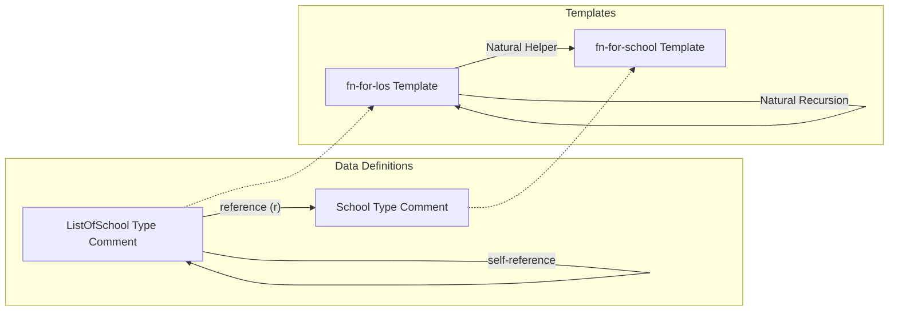

# Ghi chú: Reference — Tham chiếu giữa các kiểu dữ liệu

> **Khóa học:** How to Code: Simple Data  
> **Giảng viên:** Gregor Kiczales  
> **Chủ đề:** 4b. Reference

---

## 1. Khái niệm Reference (Tham chiếu)

Ở phần **4a. Self-Reference**, chúng ta đã học cách định nghĩa một kiểu dữ liệu tự tham chiếu đến chính nó (ví dụ: `ListOfNumber` tham chiếu đến `ListOfNumber`).

Ở phần **4b. Reference**, chúng ta đối mặt với các bài toán phức tạp hơn, nơi thông tin có các phần liên quan tự nhiên thuộc các kiểu khác nhau.
- **Định nghĩa:** Reference xảy ra khi định nghĩa của một kiểu dữ liệu này chứa (hoặc tham chiếu đến) một kiểu dữ liệu khác do chúng ta định nghĩa.
- **Ví dụ thực tế:** Thông tin về các trường học và học phí của chúng:
  - Một trường học (`School`) có tên và học phí.
  - Danh sách các trường học (`ListOfSchool`) chứa nhiều trường học (`School`).
  - Ở đây, kiểu `ListOfSchool` tham chiếu tới kiểu `School`.

---

## 2. Bài toán thực tế: Tuition Graph (Biểu đồ học phí)

Bài toán xuyên suốt phần này xoay quanh yêu cầu của Eva: thiết kế chương trình vẽ biểu đồ cột (bar chart) thể hiện học phí của các trường đại học khác nhau để giúp cô đưa ra quyết định chọn trường.

### Phân tích hằng số (Constant Analysis)
Gregor xác định các hằng số liên quan đến vẽ biểu đồ và đồ họa như sau:

```racket
(require 2htdp/image)

;; Constants:
(define FONT-SIZE 12)
(define FONT-COLOR "black")

(define BAR-WIDTH 30)
(define BAR-COLOR "lightblue")

(define Y-SCALE 1/200) ; Hằng số tỉ lệ để chuyển học phí thành chiều cao bar (ví dụ: $20,000 / 200 = 100 pixels)
```

---

## 3. Thiết kế Data Definition với Reference

Mối quan hệ dữ liệu trong bài toán:
- Ta cần biểu diễn thông tin cho **số lượng trường học tùy ý (arbitrary number of schools)**.
- Với mỗi trường học, ta cần biết **tên trường** và **học phí**.
- Gregor thiết kế bằng cách tách làm **2 kiểu dữ liệu riêng biệt** (một kiểu cho một trường học đơn lẻ, một kiểu cho danh sách các trường học).

### 3.1. Thiết kế 2 kiểu (Standard 2-Type Solution)

#### Kiểu 1: `School` (Compound Data)
```racket
(define-struct school (name tuition))
;; School is (make-school String Natural)
;; interp. a school with its name and tuition in USD (US dollars)

(define S1 (make-school "School1" 27797))
(define S2 (make-school "School2" 23300))
(define S3 (make-school "School3" 28500))

#;
(define (fn-for-school s)
  (... (school-name s)
       (school-tuition s)))
```

#### Kiểu 2: `ListOfSchool` (Self-Referential List referencing School)
```racket
;; ListOfSchool is one of:
;;  - empty
;;  - (cons School ListOfSchool)
;; interp. a list of schools

(define LOS1 empty)
(define LOS2 (cons S1 (cons S2 (cons S3 empty))))

#;
(define (fn-for-los los)
  (cond [(empty? los) (...)]
        [else
         (... (fn-for-school (first los))      ; Reference Rule: School (Natural Helper)
              (fn-for-los (rest los)))]))      ; Self-reference Rule: ListOfSchool (Natural Recursion)
```

---

## 4. Quy tắc Template thiết kế (Template Rules) & Mối quan hệ tương quan

Giáo sư Gregor nhấn mạnh chủ đề cốt lõi của khóa học:
> 🔑 **The Structural Chain:**  
> **Structure of the information $\rightarrow$ Structure of the data $\rightarrow$ Structure of the templates $\rightarrow$ Structure of the functions**  
> (Cấu trúc thông tin $\rightarrow$ Cấu trúc dữ liệu $\rightarrow$ Cấu trúc template $\rightarrow$ Cấu trúc hàm)

### 4.1. Nhận diện các mối liên kết (Arrows) trong Type Comment
Trong phần định nghĩa kiểu dữ liệu `ListOfSchool`:
- Có một mũi tên **Self-reference** tự chỉ vào chính nó (ListOfSchool).
- Có một mũi tên **Reference** chỉ từ `School` sang phần định nghĩa của `School` (được ký hiệu bằng chữ **`r`**).

### 4.2. Ánh xạ từ Type Comment sang Template
Quy tắc dịch chuyển từ cấu trúc dữ liệu sang template cực kỳ hệ thống:

1. **Self-reference Rule $\rightarrow$ Natural Recursion:**  
   Vì `(rest los)` có kiểu `ListOfSchool`, ta thực hiện lời gọi đệ quy tự nhiên: `(fn-for-los (rest los))`.
2. **Reference Rule $\rightarrow$ Natural Helper:**  
   Vì `(first los)` có kiểu `School` (một kiểu dữ liệu tự định nghĩa phi nguyên bản - non-primitive type), ta bắt buộc phải gọi hàm template bổ trợ tự nhiên: **`(fn-for-school (first los))`**.

Mối quan hệ đan xen này được biểu diễn trực quan như sau:



---

## 5. Thiết kế thay thế: 1 kiểu (Alternative 1-Type Solution)

Trong file starter [alternative-tuition-graph-starter.rkt](file:///d:/Code/ReviewOssu/reviews_ossu/2.Core_CS/1.Core_Programming/1.How_to_Code_SimpleData/Lecture%204/4b.%20Reference/alternative-tuition-graph-starter.rkt), chúng ta có cách thiết kế gộp (giống Linked List):

```racket
(define-struct school (name tuition next))

;; School is one of:
;;  - false
;;  - (make-school String Natural School)
;; interp. an arbitrary number of schools, where for each school we 
;;         have its name and its tuition in USD.
```

### So sánh 2 cách thiết kế:

| Đặc điểm | Thiết kế 2 kiểu (Standard) | Thiết kế 1 kiểu (Alternative) |
|----------|---------------------------|-------------------------------|
| **Cấu trúc** | Tách biệt thực thể `School` và danh sách `ListOfSchool`. | Gộp cả thực thể và liên kết kế tiếp (`next`) vào một struct. |
| **Tính tái sử dụng** | Rất cao. Kiểu `School` có thể dùng trong các cấu trúc dữ liệu khác. | Thấp. `School` luôn đi kèm với liên kết kế tiếp. |
| **Sự phức tạp của Template** | 2 hàm gọi nhau $\rightarrow$ dễ chia nhỏ và quản lý code độc lập. | 1 hàm lớn xử lý tất cả các trường. |

---

## 6. Thiết kế hàm `chart` — Sức mạnh của "Examples First"

Bài giảng thứ ba minh họa một nguyên lý tối quan trọng của quy trình HtDF: **Thiết kế ví dụ (Examples/Tests) trước khi viết thân hàm**. 

Khi gặp một bài toán vẽ hình phức tạp như `chart`, việc viết ví dụ cụ thể buộc chúng ta phải giải quyết các vấn đề đồ họa chi tiết trước khi cố gắng khái quát hóa nó thành một hàm tổng quát.

### 6.1. Signature, Purpose & Stub của hàm `chart`
```racket
;; ListOfSchool -> Image
;; Vẽ biểu đồ cột hiển thị tên và học phí của các trường học trong danh sách
(define (chart los) (square 0 "solid" "white")) ; stub
```

### 6.2. Thiết kế Examples / Tests từng bước một (Incremental Testing)

Thay vì viết toàn bộ test phức tạp ngay từ đầu, ta có thể xây dựng và chạy thử từng phần để phát hiện lỗi sớm (ví dụ: viết sai thứ tự đối số của `rotate`).

#### Bước 1: Thiết kế Base Case (Trường hợp cơ sở)
Nếu danh sách rỗng, ta trả về một hình ảnh rỗng (hoặc hình vuông kích thước 0):
```racket
(check-expect (chart empty) (square 0 "solid" "white"))
```

#### Bước 2: Thiết kế trường hợp 1 trường học (1-element list)
Để vẽ cột cho trường `"S1"` có học phí `8000`:
- **Chữ xoay dọc:** `(rotate 90 (text "S1" FONT-SIZE FONT-COLOR))` (Gregor nhấn mạnh việc chạy thử giúp nhận ra góc quay `-90` hay `90` đúng hướng).
- **Cột màu:** `(rectangle BAR-WIDTH (* 8000 Y-SCALE) "solid" BAR-COLOR)`
- **Đường viền cột:** `(rectangle BAR-WIDTH (* 8000 Y-SCALE) "outline" "black")`
- **Ghép đè và căn chỉnh chân:** Để chữ nằm gọn phía dưới cột và thẳng hàng ở đáy, ta dùng `overlay/align "center" "bottom"`.
- **Đặt cạnh nhau:** Khi ghép cột này với kết quả của danh sách còn lại (ở đây là base case), ta dùng `beside/align "bottom"`.

```racket
(check-expect (chart (cons (make-school "S1" 8000) empty))
              (beside/align "bottom"
                            (overlay/align "center" "bottom"
                                           (rotate 90 (text "S1" FONT-SIZE FONT-COLOR))
                                           (rectangle BAR-WIDTH (* 8000 Y-SCALE) "outline" "black")
                                           (rectangle BAR-WIDTH (* 8000 Y-SCALE) "solid" BAR-COLOR))
                            (square 0 "solid" "white")))
```

#### Bước 3: Thiết kế trường hợp 2 trường học (2-element list)
Ta thêm trường `"S2"` học phí `12000` vào đầu danh sách, và ghép nó cạnh kết quả đã vẽ của `"S1"` ở bước trên bằng `beside/align "bottom"`.

```racket
(check-expect (chart (cons (make-school "S2" 12000)
                           (cons (make-school "S1" 8000) empty)))
              (beside/align "bottom"
                            (overlay/align "center" "bottom"
                                           (rotate 90 (text "S2" FONT-SIZE FONT-COLOR))
                                           (rectangle BAR-WIDTH (* 12000 Y-SCALE) "outline" "black")
                                           (rectangle BAR-WIDTH (* 12000 Y-SCALE) "solid" BAR-COLOR))
                            (beside/align "bottom"
                                          (overlay/align "center" "bottom"
                                                         (rotate 90 (text "S1" FONT-SIZE FONT-COLOR))
                                                         (rectangle BAR-WIDTH (* 8000 Y-SCALE) "outline" "black")
                                                         (rectangle BAR-WIDTH (* 8000 Y-SCALE) "solid" BAR-COLOR))
                                          (square 0 "solid" "white"))))
```

### 6.3. Tại sao "Examples First" lại mạnh mẽ ở các bài toán khó?
- **Khái quát hóa luôn khó hơn cụ thể hóa:** Việc suy nghĩ và viết hàm tổng quát ngay từ đầu rất dễ làm chúng ta rối trí. Giải quyết bài toán trên một ví dụ cụ thể (như `"S1"` học phí `8000`) giúp ta dễ hình dung.
- **Phát hiện lỗi tức thì:** Giúp ta tìm ra ngay thứ tự đối số sai, các hàm căn chỉnh không khớp (ví dụ: dùng `beside` thông thường khiến các cột bay lơ lửng không thẳng hàng ở đáy, buộc ta phải chuyển sang dùng `beside/align "bottom"`).
- **Làm rõ mong muốn thực tế:** Nó buộc ta phải xác định rõ ràng biểu đồ sẽ trông như thế nào, căn lề ra sao trước khi bắt tay vào gõ dòng code logic đầu tiên.

---

*Ghi chú sẽ tiếp tục cập nhật khi chúng ta đi sâu vào phần code thân hàm và thiết kế hàm lowest-tuition của bài toán này...*
